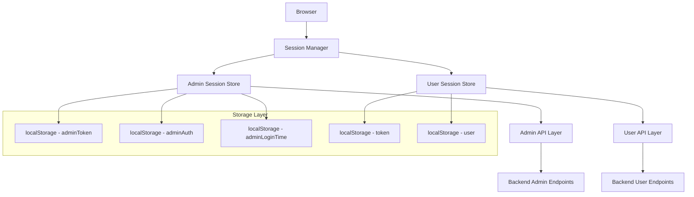
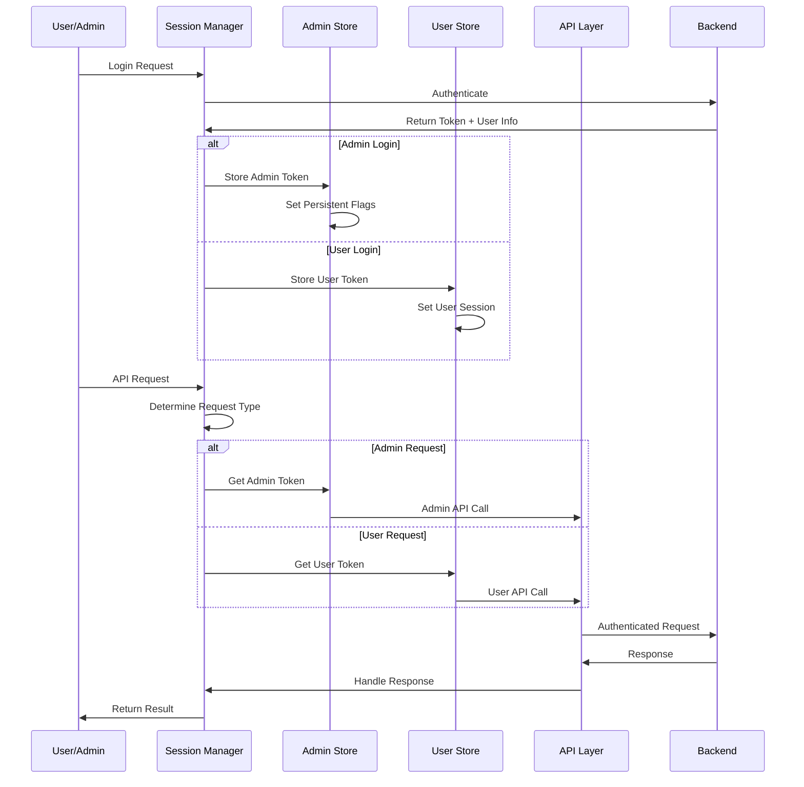
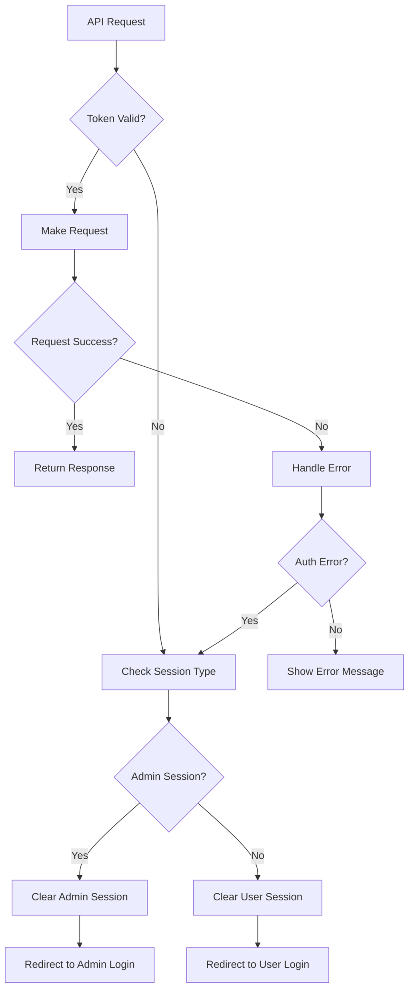

# Design Document

## Overview

This design implements a robust admin session management system that addresses the critical issues of session persistence, session separation, and API reliability. The solution provides separate token management for admin and regular users, implements persistent session storage, and ensures proper error handling for API operations.

## Architecture

### Session Management Architecture



### Token Flow Architecture



## Components and Interfaces

### 1. Enhanced Session Manager

**Purpose**: Central session management with complete separation between admin and user sessions.

**Interface**:
```javascript
class SessionManager {
  // Admin session methods
  setAdminSession(token, userInfo, options = {})
  getAdminSession()
  clearAdminSession()
  isAdminSessionValid()
  
  // User session methods
  setUserSession(token, userInfo, options = {})
  getUserSession()
  clearUserSession()
  isUserSessionValid()
  
  // Session validation
  validateSession(sessionType)
  handleSessionExpiry(sessionType)
  
  // Navigation helpers
  redirectToLogin(sessionType)
}
```

### 2. Persistent Storage Manager

**Purpose**: Handle persistent storage with proper cleanup and validation.

**Interface**:
```javascript
class PersistentStorageManager {
  // Storage operations
  setItem(key, value, options = {})
  getItem(key, defaultValue = null)
  removeItem(key)
  clearNamespace(namespace)
  
  // Session persistence
  persistAdminSession(sessionData)
  restoreAdminSession()
  persistUserSession(sessionData)
  restoreUserSession()
  
  // Validation
  validateStoredSession(sessionData)
  isSessionExpired(sessionData)
}
```

### 3. Enhanced Admin API Layer

**Purpose**: Dedicated admin API with proper error handling and session management.

**Interface**:
```javascript
class AdminAPI {
  // Core request method
  request(endpoint, method, data, options)
  
  // HTTP methods
  get(endpoint, options)
  post(endpoint, data, options)
  put(endpoint, data, options)
  delete(endpoint, options)
  
  // Admin-specific methods
  updateUserStatus(userId, status)
  getDashboardStats()
  getUsers(page, limit, search)
  getAnalytics(timeRange)
  
  // Error handling
  handleAuthError(error)
  handleNetworkError(error)
  retryRequest(requestConfig, maxRetries)
}
```

### 4. Session Validation Service

**Purpose**: Centralized session validation with proper error handling.

**Interface**:
```javascript
class SessionValidationService {
  // Validation methods
  validateAdminSession()
  validateUserSession()
  validateToken(token, sessionType)
  
  // Session checks
  isTokenExpired(token)
  isUserActive(userId)
  hasAdminPermissions(userId)
  
  // Recovery methods
  attemptSessionRecovery(sessionType)
  handleValidationFailure(sessionType, error)
}
```

## Data Models

### Admin Session Model
```javascript
{
  token: string,           // JWT token for admin
  user: {
    id: number,
    username: string,
    isAdmin: boolean
  },
  loginTime: number,       // Timestamp of login
  expiresAt: number,       // Token expiration timestamp
  persistent: boolean,     // Whether session should persist
  lastActivity: number     // Last activity timestamp
}
```

### User Session Model
```javascript
{
  token: string,           // JWT token for user
  user: {
    id: number,
    username: string,
    isActive: boolean
  },
  loginTime: number,       // Timestamp of login
  expiresAt: number,       // Token expiration timestamp
  lastActivity: number     // Last activity timestamp
}
```

### Session Storage Keys
```javascript
// Admin session keys
ADMIN_TOKEN = 'adminToken'
ADMIN_AUTH = 'adminAuthenticated'
ADMIN_LOGIN_TIME = 'adminLoginTime'
ADMIN_USER = 'adminUser'
ADMIN_SESSION_DATA = 'adminSessionData'

// User session keys
USER_TOKEN = 'token'
USER_DATA = 'user'
USER_SESSION_DATA = 'userSessionData'
```

## Error Handling

### Session Error Types
1. **TokenExpiredError**: Token has expired
2. **InvalidTokenError**: Token is malformed or invalid
3. **SessionMixingError**: Attempt to use wrong session type
4. **NetworkError**: API request failed
5. **AuthorizationError**: Insufficient permissions

### Error Recovery Strategies
1. **Automatic Token Refresh**: Attempt to refresh expired tokens
2. **Session Cleanup**: Clear corrupted session data
3. **Graceful Degradation**: Redirect to appropriate login
4. **User Notification**: Inform user of session issues

### Error Handling Flow


## Testing Strategy

### Unit Tests
1. **Session Manager Tests**
   - Test admin session creation and validation
   - Test user session creation and validation
   - Test session separation
   - Test session persistence

2. **Storage Manager Tests**
   - Test persistent storage operations
   - Test session restoration
   - Test cleanup operations

3. **API Layer Tests**
   - Test admin API calls with proper tokens
   - Test error handling for expired tokens
   - Test retry mechanisms

### Integration Tests
1. **Session Flow Tests**
   - Test complete admin login flow
   - Test session persistence across browser restarts
   - Test session separation during user management

2. **Error Scenario Tests**
   - Test behavior when admin disables user while admin session active
   - Test token expiration handling
   - Test network error recovery

### End-to-End Tests
1. **Admin Dashboard Tests**
   - Test admin login and dashboard access
   - Test user status toggle functionality
   - Test session persistence after browser restart

2. **Session Isolation Tests**
   - Test that admin session doesn't interfere with user sessions
   - Test that user management doesn't affect admin session

## Implementation Phases

### Phase 1: Core Session Management
- Implement SessionManager class
- Implement PersistentStorageManager class
- Update admin login to use new session management

### Phase 2: API Layer Enhancement
- Fix "api is not defined" error in AdminDashboard
- Implement enhanced AdminAPI class
- Update all admin API calls to use new API layer

### Phase 3: Session Validation
- Implement SessionValidationService
- Add session validation to all protected routes
- Implement proper error handling and recovery

### Phase 4: Testing and Refinement
- Add comprehensive test coverage
- Test session persistence across browser restarts
- Verify session separation between admin and users

## Security Considerations

1. **Token Storage**: Use secure localStorage with proper cleanup
2. **Session Validation**: Validate sessions on every critical operation
3. **Error Information**: Don't expose sensitive information in error messages
4. **Session Timeout**: Implement proper session timeout handling
5. **CSRF Protection**: Ensure proper CSRF protection for admin operations